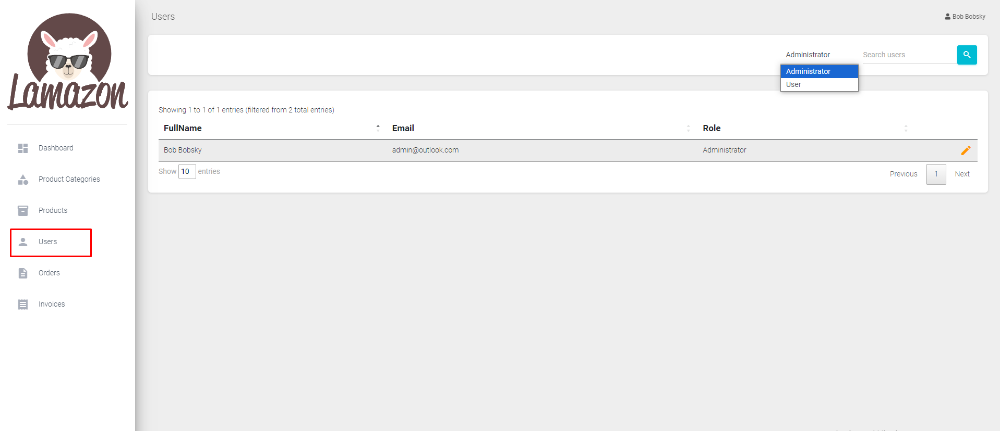
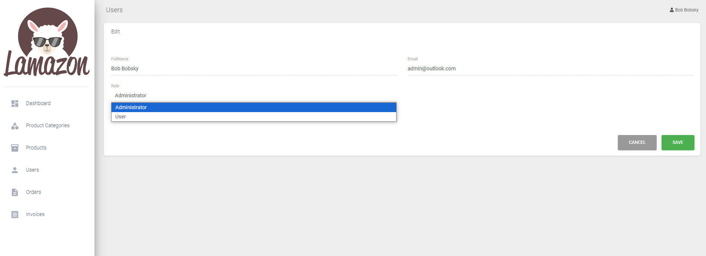
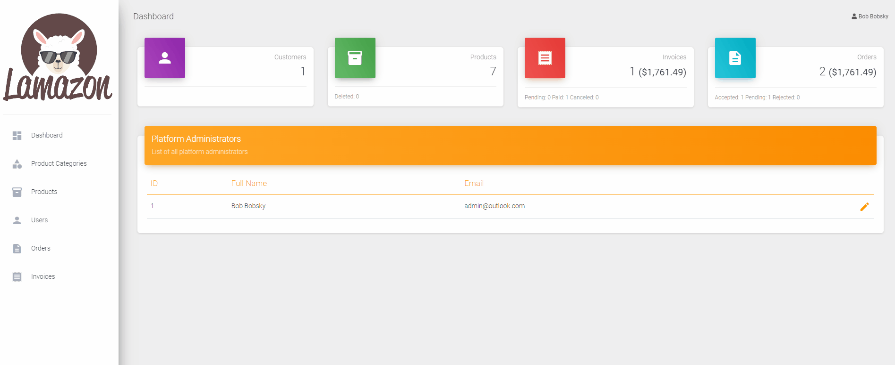

# Homework - Users Tab Implementation 🙋‍♂️

## Description 📝

As a final touch to our LAMAZON application, you will need to implement the "Users" tab in the Administration panel.

The view should have table with users rendered in it. The table should be implemented using the Datatables library with server-side rendering. 

There should be a dropdown that will filter the users in the table based on their Role (Administrator or User). Search functionality should be also implemented.

Implement Edit functionality for the users. Note that only the Role should be editable !

## Flow ⏯️	

## Hint 💡

Use the implementation of the other tabs as guidance

## Feel free to contact us if you have any blockers ❕

### Happy coding 🌞